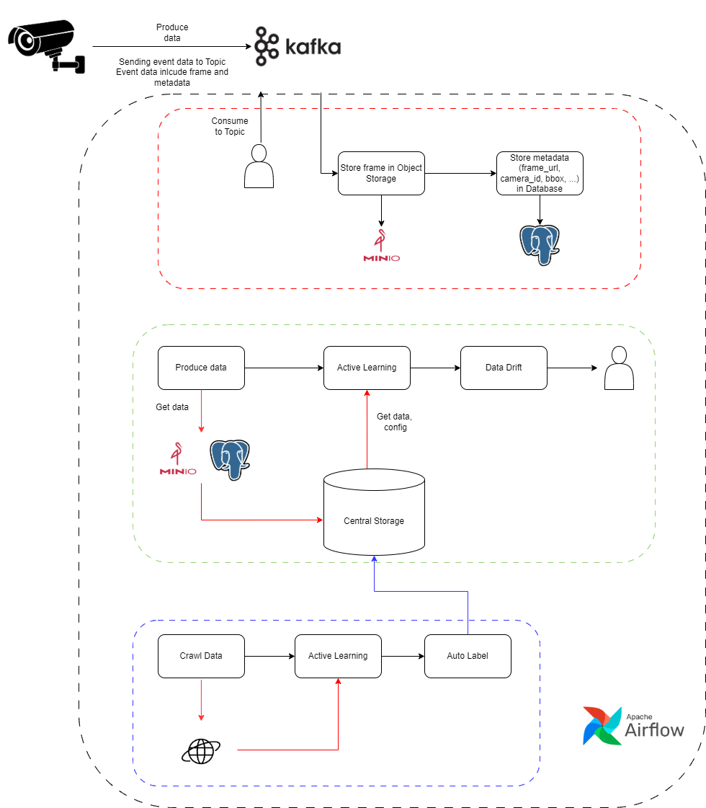

# Data Recall System

## Introduction
Manage data recall process to improve the accuracy of AI models



## Features
- Manage event receiving stream from camera
- Stream management re-validates data collected from cameras
- Manage data crawl flow and perform auto labeling

## Installation

```bash
# Clone repository
git clone https://github.com/username/data-recall-system.git

# Navigate to project directory
cd data-recall-system

# Run shell scrpts
./docker-up-with-airflow.sh
```

## License
MQ ICT SOLUTIONS